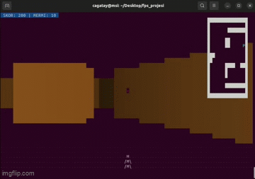

# Saf C++ Terminal FPS Motoru (Pure C++ Terminal FPS Engine)

Düşük seviyeli algoritmaların ve C++ verimliliğinin yüksek performanslı bir gösterimi olan bu proje; herhangi bir harici kütüphane (OpenGL, SDL, SFML vb.) kullanmadan, tamamen sıfırdan inşa edilmiştir.

---

## TANITIM

Bu motor, klasik Ray Casting algoritmasını kullanarak 2D harita verilerini terminal üzerinde 3D perspektife dönüştürür. Görselleştirme tamamen ASCII karakterleri ve ANSI renk kodları ile Linux terminali üzerinde gerçekleştirilir.

### Teknik Özellikler ve Geliştirme Detayları
* **Çekirdek Render Motoru:** Wolfenstein 3D tarzı, 2D harita verisini 3D perspektife dönüştüren Ray Casting algoritması.
* **Modüler Mimari:** Proje; `Motor`, `Oyuncu`, `Harita`, `Terminal`, `Dusman` ve `Ses` sınıfları ile profesyonel bir yapıya sahiptir.
* **Sprite Sistemi & Z-Buffer:** Düşmanların (yeşil @ karakterleri) derinlik kontrolü yapılarak duvarların arkasında kalması sağlandı.
* **Matematiksel Ses Sentezi:** Dışarıdan ses dosyası yüklemek yerine; sinüs dalgaları ve beyaz gürültü kullanılarak silah patlaması ve vuruş sesleri kodla üretildi.
* **Dinamik Lokal Radar:** Oyuncuyu merkeze alan, hareketle birlikte kayan 9x9 boyutunda modern bir mini harita sistemi eklendi.
* **Varlık Fiziği ve Hasar:** Düşmanların içinden geçmeyi engelleyen çarpışma fiziği ve oyuncuya temas ettiklerinde can azaltan hasar sistemi kuruldu.
* **HUD ve Arayüz:** Skor, mermi ve can durumunu gösteren, can azaldığında renk değiştiren dinamik bir bilgi paneli eklendi.

### Oyun İçi Görünüm

### Kurulum ve Çalıştırma
1.  **Sesleri Üret:** `g++ ses_uretici.cpp -o ses_uretici && ./ses_uretici`
2.  **Dosyaları Düzenle:** `mkdir -p sesler && mv *.wav sesler/`
3.  **Derle ve Başlat:** `make && ./fps_oyun`

### Kontroller
* **W / S:** İleri - Geri Hareket
* **A / D:** Sağa - Sola Dönüş
* **Space (Boşluk):** Ateş Etme
* **Q:** Oyundan Çıkış

---
## Teknik Dokümantasyon ve Matematiksel Altyapı

Projenin arkasındaki tüm mühendislik detaylarını, el yazısı notlarım ve formüllerle birlikte aşağıda bulabilirsiniz:

**[Teknik Notlar: Raycasting, DDA ve Prosedürel Ses (PDF)](./Raycast.pdf)**

### Notlarda Neler Var?
* [cite_start]**Raycasting Motoru:** Mesafe hesaplama ($h = H/d$) ve balık gözü (fish-eye) düzeltme formülleri[cite: 90, 97].
* [cite_start]**Prosedürel Ses Sentezi:** Silah ateşleme ve darbe seslerinin sinüs dalgaları ve frekans kayması ($f(t)$) ile matematiksel üretimi[cite: 81, 85, 104].
* [cite_start]**DDA Algoritması:** Mermi takibi ve duvar çarpışma kontrollerinin ızgara (grid) üzerindeki mantığı[cite: 115, 143].
* [cite_start]**Fizik ve Hareket:** Bakış açısına göre trigonometrik konum güncelleme ($x', y'$) ve $dt$ (Delta Time) yönetimi[cite: 136, 137].
* [cite_start]**Oyun Döngüsü:** Giriş, fizik güncelleme ve render akış şeması [cite: 156-161].

## DESCRIPTION

A high-performance demonstration of low-level algorithms and C++ efficiency. This engine translates 2D map data into an immersive 3D perspective rendered entirely through ASCII characters and ANSI color sequences on the Linux terminal.

### Technical Features & Development Details
* **Core Render Engine:** Wolfenstein 3D style Ray Casting algorithm for 3D projection.
* **Modular Architecture:** Structured with professional classes including `Motor`, `Oyuncu`, `Harita`, `Terminal`, `Dusman`, and `Ses`.
* **Sprite System & Z-Buffer:** Implemented a depth buffer to ensure enemies (green @ symbols) are correctly occluded by walls.
* **Procedural Audio Synthesis:** Instead of external assets, gunshots and hit sounds were mathematically synthesized using sine waves and white noise.
* **Dynamic Local Radar:** A modern 9x9 localized mini-map that follows the player in real-time.
* **Entity Physics & Damage:** Per-axis collision physics to prevent ghosting through enemies and a damage system that reduces HP upon contact.
* **HUD & Interface:** Real-time display for Health, Score, and Ammo with dynamic color alerts for low health.

### Gameplay Preview

### Installation & Execution
1.  **Synthesize Audio:** `g++ ses_uretici.cpp -o ses_uretici && ./ses_uretici`
2.  **Organize Assets:** `mkdir -p sesler && mv *.wav sesler/`
3.  **Compile & Run:** `make && ./fps_oyun`

### Controls
* **W / S:** Move Forward / Backward
* **A / D:** Look Left / Right (Rotation)
* **Space:** Fire Weapon
* **Q:** Quit Game

---
## Technical Documentation & Mathematical Foundation

This project is built from scratch without external graphics libraries. You can find the complete engineering breakdown, including handwritten notes and formulas, in the following document:

**[Technical Notes: Raycasting, DDA & Procedural Audio (PDF)](./Raycast.pdf)**

### What's Inside?
* [cite_start]**Raycasting Engine:** Core mechanics of 3D projection using distance-to-height ratios ($h = H/d$) [cite: 16, 90] [cite_start]and fish-eye effect correction using $d_{\text{corrected}} = d \cdot \cos(\alpha - \beta)$[cite: 23, 97].
* [cite_start]**Procedural Audio Synthesis:** Real-time generation of gunshot effects via linear pitch sliding ($f(t) = f_{\text{start}} - (k \cdot t)$) [cite: 26, 100] [cite_start]and impact sounds using exponential amplitude decay ($A(t) = A_0 \cdot e^{-\lambda t}$)[cite: 34, 108].
* [cite_start]**DDA Algorithm:** Precise bullet tracking and wall collision detection by stepping through the 2D grid[cite: 115, 143, 144].
* [cite_start]**Physics & Movement:** Trigonometric position updates ($x', y'$) calculated with Delta Time ($dt$) for frame-independent movement[cite: 136, 137].
* [cite_start]**Entity Hitboxes:** Collision logic for enemies using Euclidean distance: $\sqrt{(Mx - ex)^2 + (My - ey)^2} < r$[cite: 57, 147].
* [cite_start]**System Architecture:** Detailed Game Loop breakdown (Input → Physics Update → Raycast Render → Terminal Output) [cite: 156-161].

**Geliştirici / Developer:** Mustafa Cagatay OZDEM
